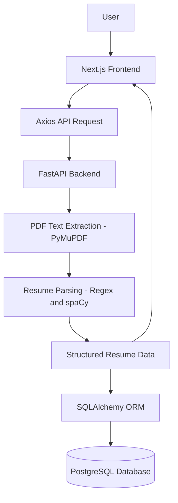

# AI Resume Parser


An AI/NLP-powered full-stack recruitment platform that allows candidates to upload and manage resumes while recruiters can create job descriptions, search and rank candidates, compare required skills against resumes, and view candidate profiles.

The application combines resume parsing, authentication, role-based access control, job management, and skill-based resume-job matching into a single full-stack system.


## Overview

**AI Resume Parser** is a full-stack portfolio/academic project built using Next.js, FastAPI, PostgreSQL, and NLP-based resume processing.

The platform supports two primary user roles:

- **Candidate**
- **Recruiter**

### Candidate Workflow

Candidates can:

- Register and log in
- Upload PDF resumes
- Automatically extract resume information
- View parsed resume data
- Manage their resume records
- View extracted skills
- Match their resume against jobs

### Recruiter Workflow

Recruiters can:

- Register and log in
- Create job descriptions
- Define required skills for a job
- View their created jobs
- Delete their jobs
- Find candidates for a specific job
- Rank candidates based on skill matching
- View matched and missing skills
- View individual candidate profiles
- View candidate contact information and extracted skills

The current matching system uses **skill-based matching**. Semantic embeddings and advanced AI matching can be added as future enhancements.

This is a functional portfolio/academic project and is not intended to represent an enterprise-scale production recruitment platform.


## Current Features

### Authentication & Authorization

- User registration
- User login
- JWT-based authentication
- Password hashing using Argon2
- Protected API endpoints
- Candidate and recruiter roles
- Role-based access control (RBAC)
- Recruiter-only job management
- Recruiter-only candidate ranking
- Candidate ownership protection
- Job ownership protection
- Unauthorized requests return appropriate HTTP status codes

---

### Resume Management

- PDF resume upload
- Resume text extraction using PyMuPDF
- Resume parsing using spaCy and regular expressions
- Candidate name extraction
- Email extraction
- Phone number extraction
- Skills extraction
- Raw resume text storage
- Parsed resume data stored in PostgreSQL
- Resume records displayed in the frontend
- Original PDF viewing support

---

### Job Management

Recruiters can:

- Create jobs
- Add job title
- Add company name
- Add job description
- Define required skills
- View their own jobs
- Delete their jobs

Jobs are associated with the recruiter who created them.

---

### Resume → Job Matching

The application includes a skill-based matching engine that compares:

```text
Candidate Resume Skills
          ↓
     Matching Engine
          ↓
Required Job Skills

---

## Application Architecture




## How It Works

1. The user uploads a PDF resume from the Upload page on the frontend.
2. The frontend sends the file to the FastAPI backend via an Axios API request.
3. The backend extracts raw text from the PDF using PyMuPDF.
4. The extracted text is parsed using spaCy and regular expressions to identify the candidate's name, email, phone number, and skills.
5. The structured data is saved to PostgreSQL using SQLAlchemy.
6. The structured data is returned to the frontend as JSON and displayed to the user.
7. User can also see the original PDF of the parsed resume from the parsed resume section


## Tech Stack

### Frontend

| Technology | Purpose |
|---|---|
| Next.js (App Router) | React framework for the frontend |
| TypeScript | Type-safe frontend development |
| Tailwind CSS | Utility-first styling |
| ShadCN UI | UI components |
| Axios | HTTP client for API requests |

### Backend

| Technology | Purpose |
|---|---|
| Python | Core backend language |
| FastAPI | REST API framework |
| Uvicorn | ASGI server |

### Resume Processing

| Technology | Purpose |
|---|---|
| PyMuPDF | PDF text extraction |
| spaCy | NLP-based parsing |
| Regex | Pattern-based field extraction |

### Database

| Technology | Purpose |
|---|---|
| PostgreSQL | Persistent data storage |
| SQLAlchemy | ORM |
| psycopg2 | PostgreSQL adapter |


## Database Schema

PostgreSQL is used for persistent storage, with SQLAlchemy as the ORM.

**Table: `resumes`**

| Field | Purpose |
|---|---|
| `id` | Unique resume identifier |
| `name` | Candidate name |
| `email` | Candidate email |
| `phone` | Candidate phone number |
| `skills` | Extracted skills |
| `raw_text` | Extracted resume text |


## API Overview

The backend exposes a FastAPI REST API responsible for:

- Receiving uploaded PDF resumes
- Extracting text from the PDF
- Parsing resume information
- Returning structured JSON to the frontend
- Saving parsed resume information to PostgreSQL

The backend is organized into the following areas:

- `routes/` — API endpoint definitions (e.g., resume upload)
- `parsers/` — Resume text extraction and parsing logic
- `models/` — Database models
- `database/` — Database connection and configuration

Interactive API documentation is automatically available via FastAPI at `/docs` once the backend is running.


## Local Installation (Windows)

### Backend

```bash
cd backend
python -m venv venv
venv\Scripts\activate
pip install -r requirements.txt
uvicorn app.main:app --reload
```

### Frontend

```bash
cd frontend
npm install
npm run dev
```


## Environment Variables

The backend requires a `.env` file for configuration. The actual `.env` file is never committed to the repository — only `backend/.env.example` is tracked in version control.

To set up your environment:

1. Copy the example file:

```bash
copy backend\.env.example backend\.env
```

2. Open `backend/.env` and set your own PostgreSQL connection string for the `DATABASE_URL` variable.

Do not commit real credentials or passwords to the repository.


## Running the Application

This project runs as two separate servers during development.

**Backend (FastAPI):**

```bash
cd backend
venv\Scripts\activate
uvicorn app.main:app --reload
```

- Backend API: `http://127.0.0.1:8000`
- Interactive API docs: `http://127.0.0.1:8000/docs`

**Frontend (Next.js):**

```bash
cd frontend
npm run dev
```

- Frontend: `http://localhost:3000`

Both servers must be running simultaneously for the application to work end to end.


## Contributing

This project is currently developed as a personal portfolio/academic project. Contribution guidelines will be added if the project opens up to external contributions in the future.


## License

Licensed under the MIT License


## Author

Ashutosh Maharaj
