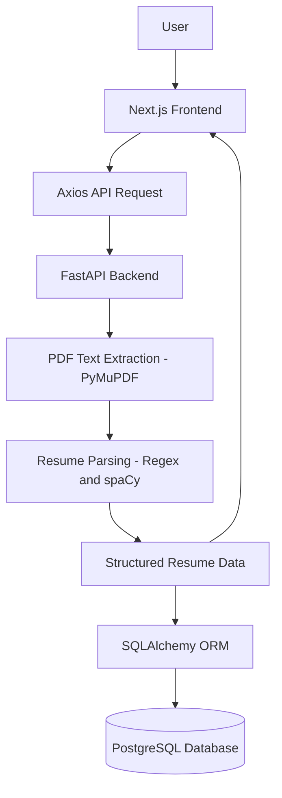

# AI Resume Parser

An AI/NLP-powered full-stack web application that lets users upload PDF resumes, automatically extracts key candidate information (name, email, phone, and skills), and stores the structured data in PostgreSQL.


---

## Overview

**AI Resume Parser** is a full-stack application built as a working portfolio/academic project. Users upload a PDF resume through a Next.js frontend. The FastAPI backend extracts raw text from the PDF, parses it using regular expressions and spaCy to identify candidate details, and stores the structured result in a PostgreSQL database. The parsed data is then returned to the frontend for display.

This is a functional demonstration of an end-to-end resume parsing pipeline, not an enterprise-scale production system.

---

## Current Features

- PDF resume upload from the frontend
- Resume text extraction using PyMuPDF
- Resume parsing using spaCy and regular expressions
- Candidate name extraction
- Email extraction
- Phone number extraction
- Skills extraction
- Parsed data displayed on the frontend
- Parsed resume data stored in PostgreSQL
- Stored resume records viewable via PostgreSQL/pgAdmin
- Frontend-to-backend communication using Axios
- FastAPI REST API
- CORS configuration
- Responsive frontend UI (Next.js, TypeScript, Tailwind CSS, ShadCN UI)

> The **Resumes** page exists in the frontend but is still under development and is not yet fully connected to live PostgreSQL data.

---

## Application Architecture



---

## How It Works

1. The user uploads a PDF resume from the Upload page on the frontend.
2. The frontend sends the file to the FastAPI backend via an Axios API request.
3. The backend extracts raw text from the PDF using PyMuPDF.
4. The extracted text is parsed using spaCy and regular expressions to identify the candidate's name, email, phone number, and skills.
5. The structured data is saved to PostgreSQL using SQLAlchemy.
6. The structured data is returned to the frontend as JSON and displayed to the user.

---

## Tech Stack

### Frontend

| Technology | Purpose |
|---|---|
| Next.js (App Router) | React framework for the frontend |
| TypeScript | Type-safe frontend development |
| Tailwind CSS | Utility-first styling |
| ShadCN UI | UI components |
| Axios | HTTP client for API requests |

### Backend

| Technology | Purpose |
|---|---|
| Python | Core backend language |
| FastAPI | REST API framework |
| Uvicorn | ASGI server |

### Resume Processing

| Technology | Purpose |
|---|---|
| PyMuPDF | PDF text extraction |
| spaCy | NLP-based parsing |
| Regular Expressions | Pattern-based field extraction |

### Database

| Technology | Purpose |
|---|---|
| PostgreSQL | Persistent data storage |
| SQLAlchemy | ORM |
| psycopg2 | PostgreSQL adapter |

### Development

- Git
- GitHub

---

## Project Structure

```
AI-Resume-Parser/
│
├── frontend/
│   ├── src/
│   │   └── app/
│   │       ├── page.tsx
│   │       ├── layout.tsx
│   │       ├── globals.css
│   │       ├── dashboard/
│   │       │   └── page.tsx
│   │       ├── uploads/
│   │       │   └── page.tsx
│   │       └── resumes/
│   │           └── page.tsx
│   ├── package.json
│   └── ...
│
├── backend/
│   ├── app/
│   │   ├── main.py
│   │   ├── database/
│   │   │   └── db.py
│   │   ├── models/
│   │   │   └── resume_model.py
│   │   ├── parsers/
│   │   │   └── resume_parser.py
│   │   └── routes/
│   │       └── upload.py
│   ├── requirements.txt
│   ├── .env.example
│   └── ...
│
├── .gitignore
└── README.md
```

---

## Database Schema

PostgreSQL is used for persistent storage, with SQLAlchemy as the ORM.

**Table: `resumes`**

| Field | Purpose |
|---|---|
| `id` | Unique resume identifier |
| `name` | Candidate name |
| `email` | Candidate email |
| `phone` | Candidate phone number |
| `skills` | Extracted skills |
| `raw_text` | Extracted resume text |

---

## API Overview

The backend exposes a FastAPI REST API responsible for:

- Receiving uploaded PDF resumes
- Extracting text from the PDF
- Parsing resume information
- Returning structured JSON to the frontend
- Saving parsed resume information to PostgreSQL

The backend is organized into the following areas:

- `routes/` — API endpoint definitions (e.g., resume upload)
- `parsers/` — Resume text extraction and parsing logic
- `models/` — Database models
- `database/` — Database connection and configuration

Interactive API documentation is automatically available via FastAPI at `/docs` once the backend is running.

---

## Local Installation (Windows)

### Backend

```bash
cd backend
python -m venv venv
venv\Scripts\activate
pip install -r requirements.txt
```

### Frontend

```bash
cd frontend
npm install
npm run dev
```

---

## Environment Variables

The backend requires a `.env` file for configuration. The actual `.env` file is never committed to the repository — only `backend/.env.example` is tracked in version control.

To set up your environment:

1. Copy the example file:

```bash
copy backend\.env.example backend\.env
```

2. Open `backend/.env` and set your own PostgreSQL connection string for the `DATABASE_URL` variable.

Do not commit real credentials or passwords to the repository.

---

## Running the Application

This project runs as two separate servers during development.

**Backend (FastAPI):**

```bash
cd backend
venv\Scripts\activate
uvicorn app.main:app --reload
```

- Backend API: `http://127.0.0.1:8000`
- Interactive API docs: `http://127.0.0.1:8000/docs`

**Frontend (Next.js):**

```bash
cd frontend
npm run dev
```

- Frontend: `http://localhost:3000`

Both servers must be running simultaneously for the application to work end to end.

---

## Example API Response

The following is an example only, based on the current `resumes` database schema. Actual field values will vary by resume.

```json
{
  "id": 1,
  "name": "John Doe",
  "email": "john.doe@example.com",
  "phone": "+1-555-123-4567",
  "skills": "Python, FastAPI, React, SQL",
  "raw_text": "Full extracted resume text..."
}
```

---


## Future Roadmap

The following features are **not currently implemented** and are potential future additions:

- Resume history
- Resume search and filtering
- Dashboard analytics
- Resume detail page
- ATS scoring
- Job description vs. resume matching
- Semantic search
- Resume embeddings
- Authentication
- Cloud deployment
- More robust resume parsing
- Support for additional document formats

---

## Known Limitations

- No authentication is currently implemented
- No cloud deployment is currently implemented
- No advanced AI/LLM functionality (e.g., OpenAI API, HuggingFace Transformers, LayoutLM) is currently implemented
- No Elasticsearch, Redis, Celery, or pgvector integration currently exists
- No AWS S3 or other cloud storage is currently used
- No Clerk, Auth.js, Docker, or Kubernetes is currently used
- Parsing accuracy depends on resume formatting and structure
- The Resumes page is still under development

---

## Contributing

This project is currently developed as a personal portfolio/academic project. Contribution guidelines will be added if the project opens up to external contributions in the future.

---

## License

<!-- Add license information here -->

---

## Author

Ashutosh Maharaj
